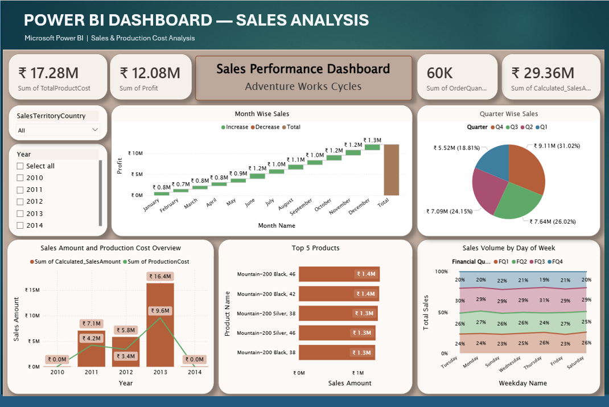
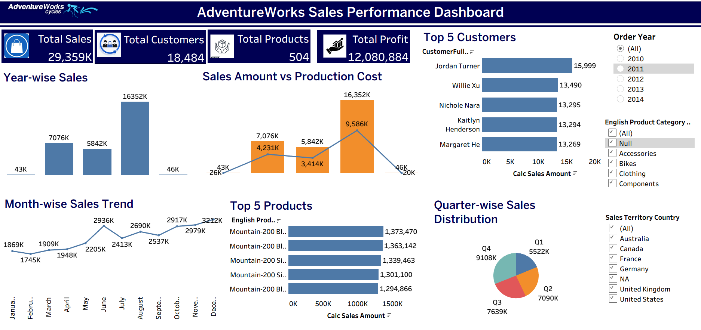

# AdventureWorks Cycles — Sales Performance Dashboard

Interactive sales analytics project built in **two modules** — Power BI and Tableau — analyzing the AdventureWorks Cycles sales dataset (2010–2014) to uncover revenue trends, profitability, and top-performing products.

---

## 🏢 About AdventureWorks Cycles

AdventureWorks Cycles is a well-known fictional company created by Microsoft as a sample dataset for BI and data analytics training. It is modeled as a large, multinational manufacturing company that produces and sells metal and composite bicycles across North American, European, and Asian markets. The dataset is widely used in the data analytics community to practice real-world sales, production, and customer analysis.

---

## 📊 Overview

| | |
|---|---|
| **Dataset** | AdventureWorks Cycles Sales Data (2010–2014), sourced from Excel files |
| **Data Preparation** | Cleaned and transformed in Power BI using Power Query |
| **Records analyzed** | 60K+ orders |
| **Tools used** | Power BI, Tableau, Power Query, DAX, LOD Expressions |
| **Data Model** | Star-schema, built in both Power BI and Tableau |
| **Modules** | 1️⃣ Power BI Dashboard &nbsp;•&nbsp; 2️⃣ Tableau Dashboard |

---

## 🧩 Module 1: Power BI Dashboard

Source data (Excel files) was cleaned and transformed using **Power Query**, then structured into a **star-schema data model**, with **DAX measures** and calculated columns for KPI tracking.

**Key Features:**
- KPI cards: Total Sales, Total Profit, Total Production Cost, Order Quantity
- Month-wise sales waterfall chart (Increase/Decrease/Total)
- Quarter-wise sales distribution (pie chart)
- Sales Amount vs. Production Cost trend (year-wise)
- Top 5 Products by sales amount
- Sales volume breakdown by day of week

**Key Insights:**
- Total Sales: **₹29.36M** | Total Profit: **₹12.08M** | Total Production Cost: **₹17.28M**
- **Q4** was the strongest quarter, contributing **31.02%** of total sales (₹9.11M)
- **Mountain-200 Black** and **Mountain-200 Silver** were the top-performing products

📁 File: `PowerBI/AdventureWorks_Sales_Dashboard.pbix`

---

## 🧩 Module 2: Tableau Dashboard

Built using the same **star-schema data model**, with **Calculated Fields** and **Level of Detail (LOD) expressions** for profit margin, year-over-year growth, and product ranking.

**Key Features:**
- Year-wise sales trend (bar chart)
- Sales Amount vs. Production Cost comparison
- Month-wise sales trend (line chart)
- Top 5 Products by sales amount
- Top 5 Customers by sales amount
- Quarter-wise sales distribution with country/category filters

**Key Insights:**
- **2013** was the peak sales year at **₹16.35M** in sales
- Top-selling product: **Mountain-200 Black** at **₹1.37M**
- Interactive filters for Order Year, Product Category, and Sales Territory Country

📁 File: `Tableau/AdventureWorks_Sales_Dashboard.twbx`

---

## 🛠️ Tech Stack

`Power BI` `Tableau` `Power Query` `DAX` `LOD Expressions` `Star-Schema Data Modeling`

---

## 🚀 How to View

- **Power BI:** Open the `.pbix` file in [Power BI Desktop](https://www.microsoft.com/en-us/power-platform/products/power-bi/downloads) (free).
- **Tableau:** Open the `.twbx` file in [Tableau Public](https://public.tableau.com/en-us/s/download) or Tableau Desktop.

---

## 👤 Author

**Shankarananda G T**
[LinkedIn](https://linkedin.com/in/shankarananda-g-t) • [GitHub](https://github.com/shankaranandagt)
